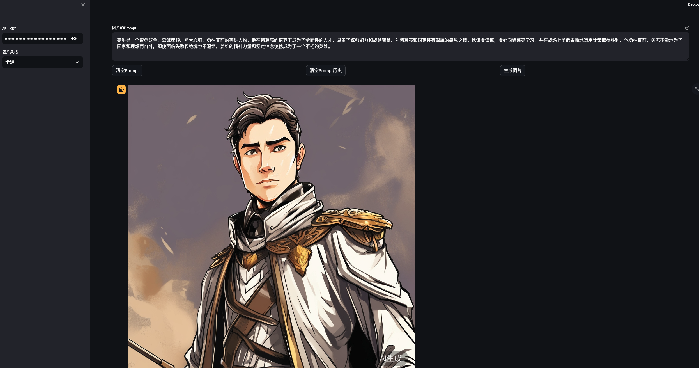

## 搭建运行环境

本项目使用 Python v3.10 开发，完整 Python 依赖软件包见[requirements.txt](requirements.txt)。

**以下是详细的安装指导（以 Ubuntu 操作系统为例）**：

### 安装 Miniconda

```shell
mkdir -p ~/miniconda3
wget https://repo.anaconda.com/miniconda/Miniconda3-latest-Linux-x86_64.sh -O ~/miniconda3/miniconda.sh
bash ~/miniconda3/miniconda.sh -b -u -p ~/miniconda3
rm -rf ~/miniconda3/miniconda.sh
```

安装完成后，建议新建一个 Python 虚拟环境，命名为 `cogview3-demo`。

```shell
conda create -n cogview3-demo python=3.10
```

### 激活环境

```shell
conda activate cogview3-demo 
```

之后每次使用需要激活此环境。

### 安装 Python 依赖软件包

#### 在`cogview3-demo`路径下运行一下命令

```shell
pip install -r requirements.txt
```

### 运行项目

```shell
streamlit run --server.address 127.0.0.1 image_generate_demo.py
```

### 启动成功

```shell
You can now view your Streamlit app in your browser.
```
通过浏览器访问

### 页面




## 许可证

该项目根据Apache-2.0许可证的条款进行许可。详情请参见[LICENSE](LICENSE)文件。


